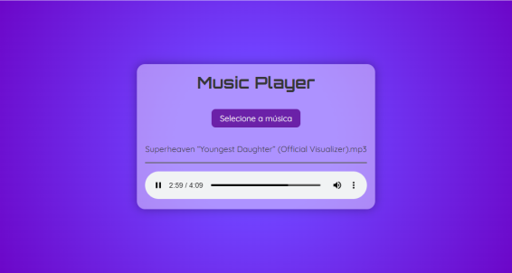

# 🎵 Music Player

Um projeto simples e funcional de um player de música que permite ao usuário carregar arquivos de áudio locais e reproduzi-los diretamente no navegador, utilizando o player nativo do HTML5. Desenvolvido com foco em aprendizado prático de HTML, CSS e JavaScript.

## 📸 Preview



## 🚀 Funcionalidades

- Upload de arquivos de áudio locais (.mp3, .wav, etc)
- Validação de formato do arquivo
- Reprodução imediata do áudio selecionado
- Exibição do nome da música carregada
- Estilização visual customizada da interface

## 🧠 Desafios enfrentados

> O maior desafio foi manusear o campo `input type="file"` para:
> - Estilizá-lo de forma visualmente agradável
> - Substituí-lo por um botão com aparência customizada
> - Capturar corretamente o arquivo de áudio selecionado pelo usuário

## 📁 Estrutura de arquivos

```
music-player/
├── index.html                # Estrutura principal da página
├── src/
│   ├── css/
│   │   └── styles.css        # Estilização da página
│   ├── images/
│   │   ├── favicon.png       # Ícone do projeto
│   │   └── preview.png       # Ícone do projeto
│   └── script/
│       └── script.js         # Lógica do player em JavaScript
├── README.md                 # Documentação do projeto
└── LICENSE                   # Licença do projeto
```

## 🌐 Como acessar o projeto

### 🔗 Online
Você pode acessar diretamente pela página do GitHub Pages:  
👉 [charlesson-mp.github.io/music-player](https://charlesson-mp.github.io/music-player)

### 🖥️ Localmente
Para rodar o projeto localmente:

```bash
# Clone o repositório
git clone https://github.com/charlesson-mp/music-player.git

# Acesse a pasta do projeto
cd music-player

# Abra o arquivo index.html no navegador
start index.html  # ou apenas dê duplo clique
```

---

Desenvolvido com 💜 por [Charlesson Mendes](https://github.com/charlesson-mp)